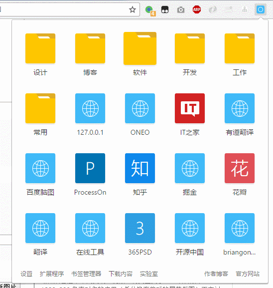

# 为什么要开发这个东西
平时给别人截图的时候，有些书签实在是不能让人看到，比如说xx学习社区，手动微笑。所以开发了这个插件，把Chrome所有的书签都展现在一个插件中，点击插件之后，就可以使用，已经开源到[Github](https://github.com/1217950746/My-Bookmarks)

# 效果图

# 更新说明

## 1.2 - 2016.10.20
* 发布

## 1.3 - 2016.10.21
* 修复    乱码
* 优化    域名图标放在远程控制中

# 下载
[Chrome 商店](https://chrome.google.com/webstore/detail/my-bookmarks/mhpbkdiffinpfabnclooagcibijabiip)